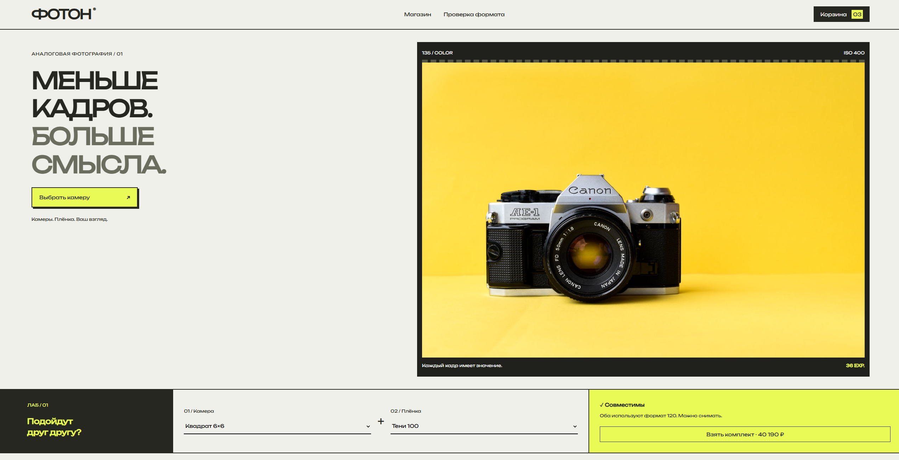
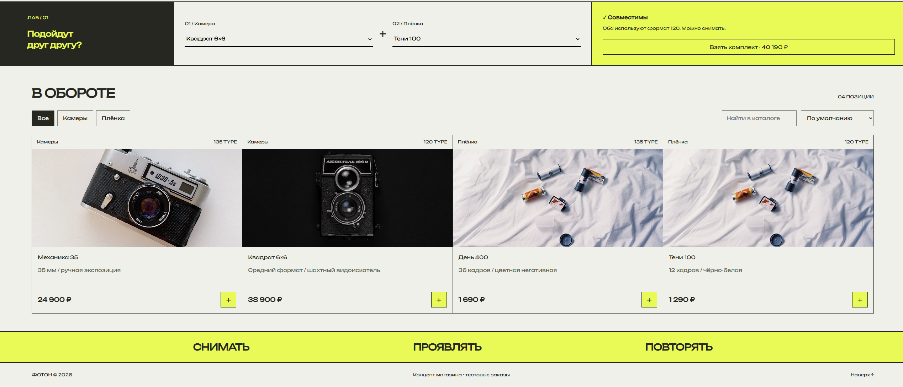
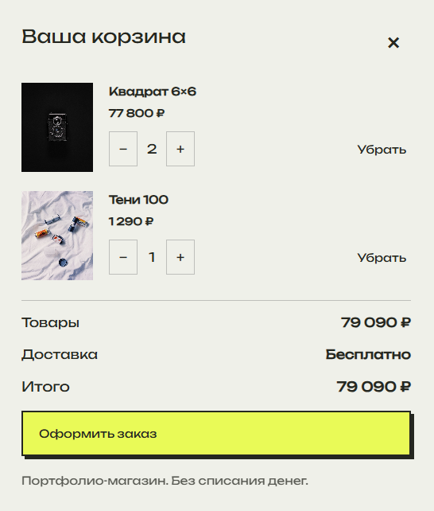
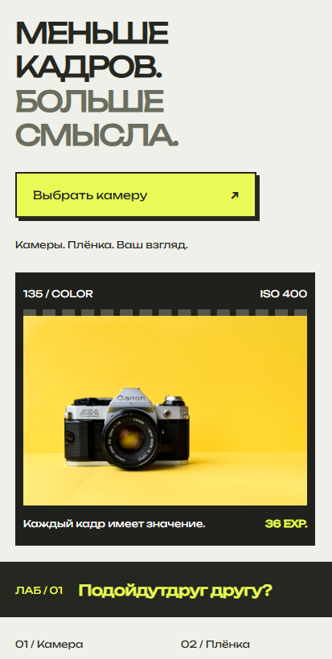

# ФОТОН

Интернет-магазин плёночных камер и фотоплёнки с полноценной корзиной, оформлением тестовых заказов и проверкой совместимости форматов.

Проект сделан как самостоятельный портфолио-кейс с клиентской частью, серверным API и локальной базой данных.

## О проекте

«ФОТОН» — концепт магазина для любителей аналоговой фотографии.

В основе проекта — каталог камер и плёнки с акцентом на визуальную подачу и простой пользовательский сценарий: найти нужный товар, проверить совместимость камеры и плёнки, собрать корзину и оформить демонстрационный заказ.

Отдельно реализована логика совместимости форматов 135 и 120, чтобы магазин был не просто набором карточек товаров, а содержал полезный интерактивный инструмент.

## Демо

[Открыть «ФОТОН»](https://foton-mu.vercel.app/)

## Превью

### Десктоп







### Мобильная версия



## Возможности

- каталог плёночных камер и фотоплёнки;
- фильтрация товаров по категориям;
- поиск по каталогу;
- сортировка по цене;
- подробная карточка товара;
- корзина с изменением количества товаров;
- сохранение корзины в `localStorage`;
- проверка совместимости камеры и плёнки;
- добавление совместимого комплекта в корзину;
- оформление тестового заказа;
- серверная проверка стоимости и остатков;
- учёт остатков товаров;
- бесплатная доставка от заданной суммы;
- адаптивный интерфейс;
- отдельный статический режим работы без сервера.

## Технологии

### Frontend

- React 19
- TypeScript
- CSS

### Backend

- Node.js
- Node HTTP Server
- SQLite

### Сборка и инструменты

- esbuild
- TypeScript Compiler
- Docker
- GitHub Actions

## API

Проект содержит собственный небольшой API.

Основные маршруты:

```text
GET  /api/health
GET  /api/catalog
POST /api/orders
GET  /api/orders/:id
```

Каталог и остатки загружаются с сервера. При оформлении заказа сервер повторно рассчитывает стоимость и проверяет доступное количество товара.

## Проверка совместимости

В проекте есть отдельный инструмент для выбора камеры и плёнки.

Совместимость определяется по формату:

```text
135 ↔ 135
120 ↔ 120
```

Если форматы совпадают, комплект можно сразу добавить в корзину.

## Локальный запуск

Для работы проекта нужен Node.js 24 или новее.

Клонировать репозиторий:

```bash
git clone https://github.com/wakukiku/photon.git
cd photon
```

Установить зависимости:

```bash
npm install
```

Запустить проект:

```bash
npm run dev
```

По умолчанию сервер запускается по адресу:

```text
http://localhost:3000
```

## Production-сборка

Собрать проект:

```bash
npm run build
```

Запустить собранную версию:

```bash
npm start
```

## Проверка типов

```bash
npm run check
```

## Тесты

```bash
npm test
```

В проекте есть тесты для:

- логики совместимости форматов;
- создания заказов;
- серверного расчёта стоимости;
- проверки остатков;
- идемпотентности заказов;
- изоляции пользовательских сессий;
- сохранности данных SQLite.

## Переменные окружения

Пример находится в `.env.example`.

```env
PORT=3000
HOST=127.0.0.1
DB_PATH=./data/store.sqlite
```

## Docker

Проект содержит `Dockerfile` и может быть запущен в контейнере.

Пример:

```bash
docker build -t foton .
docker run -p 3000:3000 foton
```

## Статус проекта

Проект завершён как демонстрационный интернет-магазин для портфолио.

Оформление заказа работает в тестовом режиме. Реальная оплата и доставка не выполняются.

---

**ФОТОН** — портфолио-проект магазина аналоговой фототехники.
